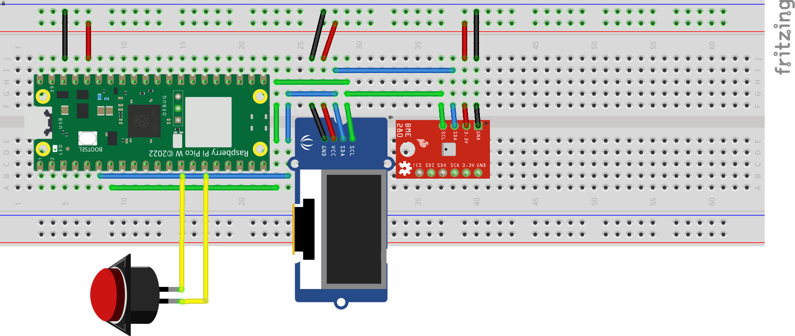

# Pico W with BME280 sensor

Project for the microprocessor course. This project consists of using the Raspberry Pi Pico W as an MQTT client, which sends the temperature data to an MQTT broker hosted at [Thingspeak](https://thingspeak.mathworks.com/).

## Requirements

### Hardware

- sensor BME280.
- OLED 128x64 0.96".
- Raspberry Pi pico W with [micropython](https://docs.micropython.org/en/latest/).
- Protoboard.
- wiring 26 AGW.
- push button.

### Software

- python3.
- [pipx](https://github.com/pypa/pipx) (recommended) or [uv](https://github.com/astral-sh/uv) -- needed to install mpremote.
- [mpremote](https://docs.micropython.org/en/latest/reference/mpremote.html).

## Connection with protoboard

### Fritzing connection scheme



> I2C pins:  
> SDA -> GP4 (pin 6)  
> SCL -> GP5 (pin 7)  
>
> Push button pins:  
> GP11 (pin 15) and GND (pin 13)
> 
> Power out pins:  
> 3.3V -> pin 36  
> GND -> pin 38

## Setup

create a file called `config.py` at the root of the project with the following values (MQTT related variables are obtained from Thingspeak).

```python
# config.py

wifi_ssid = "Your wifi SSID"
wifi_password = "Your wifi password"
mqtt_username = "Your MQTT username"
mqtt_password = "Your MQTT password"
mqtt_clientId = "Your MQTT client ID"
mqtt_channel_id = 0000000 # Your channel ID
mqtt_write_api_key = ""
mqtt_server = "mqtt3.thingspeak.com"
mqtt_port = 1883
```

Once you have all the files ready you must connect the _Pico W_ to the computer via USB, so you need to upload the python files and the `lib/` folder **one by one**

An example using the `lib/` folder:

```sh
mpremote cp -r lib/ :
```

At the end in Pico W there should be only these files:


And with that, you're ready. Now to test the code, you just have to write `mpremote run main.py`


> NOTE: This image was shot before interruptions implementation. **The correct wiring is at top of this document**. Is the _fritzing_ one.
